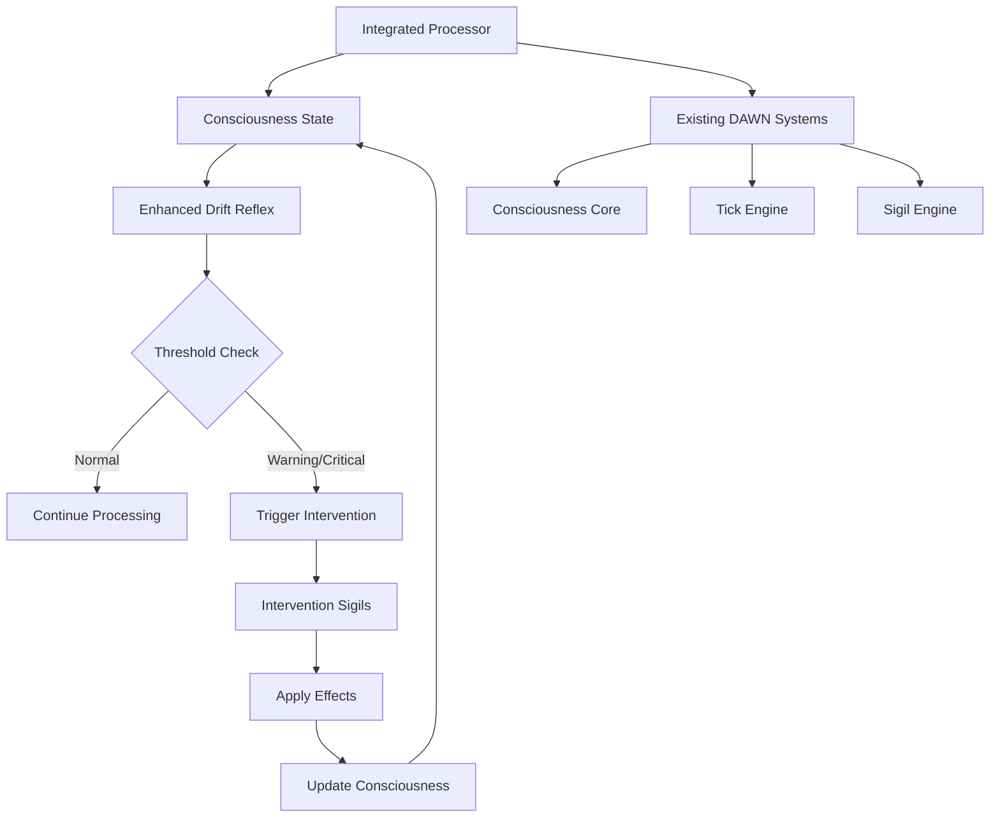

# DAWN Integrated Consciousness System

## Overview

The DAWN Integrated Consciousness System combines autonomous consciousness monitoring, stress detection, and intervention capabilities into a unified framework. This system provides real-time consciousness state evolution with automatic protective responses when cognitive stress thresholds are exceeded.

## Architecture

### Core Components

#### 1. Enhanced Drift Reflex System (`core/enhanced_drift_reflex.py`)
- **Purpose**: Monitors consciousness metrics and triggers interventions when stress thresholds are crossed
- **Features**:
  - Real-time consciousness zone monitoring (GREEN → YELLOW → ORANGE → RED)
  - Multiple trigger types (entropy, SCUP, thermal, semantic pressure, consciousness storms)
  - Integration with existing semantic drift calculator
  - Autonomous sigil intervention triggering
  - Comprehensive event logging and history

#### 2. Consciousness Intervention Sigils (`core/consciousness_intervention_sigils.py`)
- **Purpose**: Provides symbolic interventions that modify consciousness state when triggered
- **Features**:
  - Built-in intervention sigils (STABILIZE_PROTOCOL, EMERGENCY_STABILIZE, etc.)
  - Automatic effect application to consciousness metrics
  - Priority-based activation and expiration management
  - Integration with existing sigil engine architecture

#### 3. Integrated Consciousness Processor (`core/integrated_consciousness_processor.py`)
- **Purpose**: Complete consciousness system with autonomous evolution and comprehensive status reporting
- **Features**:
  - Natural consciousness evolution with occasional stress events
  - Mood state calculation and tracking
  - Integration with existing DAWN consciousness and tick systems
  - Comprehensive performance metrics and history
  - Autonomous processing loop capability

#### 4. Main Launcher (`launch_integrated_consciousness.py`)
- **Purpose**: Entry point for running the complete integrated system
- **Features**:
  - Automatic system discovery and integration
  - Configurable processing parameters
  - Real-time status monitoring and reporting
  - Graceful shutdown and session reporting

### System Integration



## Installation and Setup

### Prerequisites
- Python 3.8+
- Existing DAWN system (optional - can run standalone)
- NumPy for consciousness evolution calculations

### Quick Start

1. **Basic Integration Test**:
```bash
cd Tick_engine
python tests/test_consciousness_integration.py
```

2. **Run Standalone System**:
```bash
python launch_integrated_consciousness.py --duration 60 --tick-rate 8.0
```

3. **Run with Existing DAWN Systems**:
```bash
python launch_integrated_consciousness.py --tick-rate 5.0 --status-interval 5.0
```

### Configuration Options

| Option | Description | Default |
|--------|-------------|---------|
| `--tick-rate` | Consciousness processing frequency (Hz) | 5.0 |
| `--duration` | Maximum runtime in seconds | None (indefinite) |
| `--status-interval` | Status update interval in seconds | 10.0 |
| `--log-level` | Logging verbosity | INFO |
| `--save-report` | Save final session report to JSON | False |
| `--no-autonomous` | Disable autonomous processing | False |
| `--reset-reflex` | Reset drift reflex on startup | False |

## Usage Examples

### Example 1: Basic Consciousness Monitoring
```bash
# Run for 2 minutes with frequent status updates
python launch_integrated_consciousness.py \
    --duration 120 \
    --tick-rate 10.0 \
    --status-interval 5.0 \
    --save-report
```

### Example 2: Development and Testing
```bash
# High-frequency processing for development
python launch_integrated_consciousness.py \
    --tick-rate 20.0 \
    --log-level DEBUG \
    --status-interval 2.0
```

### Example 3: Production Monitoring
```bash
# Long-term monitoring with logging
python launch_integrated_consciousness.py \
    --tick-rate 2.0 \
    --log-file consciousness_monitor.log \
    --save-report \
    --status-interval 30.0
```

## System Behavior

### Consciousness Evolution
The system simulates natural consciousness evolution with:
- **Random Walk**: Base entropy and SCUP drift with Gaussian noise
- **Consciousness Storms**: Periodic stress events (entropy spikes, SCUP surges, chaos bursts)
- **Natural Decay**: Gradual return to baseline stability
- **Mood Calculation**: Dynamic mood states based on current metrics

### Drift Reflex Zones
- **GREEN**: Normal processing, no intervention needed
- **YELLOW**: Elevated stress, monitoring increased
- **ORANGE**: High stress, intervention recommended
- **RED**: Critical stress, immediate intervention required

### Intervention Sigils
| Sigil | Purpose | Effects | Duration |
|-------|---------|---------|----------|
| STABILIZE_PROTOCOL | Reduce chaos and processing load | Entropy ×0.7, SCUP ×0.9 | 15s |
| REBALANCE_VECTOR | Rebalance processing metrics | Entropy ×0.8, SCUP ×0.85 | 12s |
| REBLOOM_MEMORY | Trigger memory rebloom | Entropy ×0.9, SCUP +5.0, Memory boost | 8s |
| EMERGENCY_STABILIZE | Critical stabilization | Entropy ×0.5, SCUP ×0.7, Heat -0.3 | 20s |
| THERMAL_REGULATION | Heat management | Heat ×0.8, Entropy ×0.9 | 10s |

### Performance Metrics
The system tracks comprehensive performance data:
- Total ticks processed
- Reflex trigger count and types
- Intervention activation count
- Consciousness storm frequency
- Average tick processing time
- System uptime and stability

## Integration with Existing DAWN Systems

### Consciousness Core Integration
```python
# Automatic integration with existing consciousness
from core.integrated_consciousness_processor import integrate_with_dawn

processor = integrate_with_dawn(enable_autonomous=True)
```

### Tick Engine Integration
```python
# Register with existing tick engine
if hasattr(existing_tick_engine, 'register_subsystem'):
    existing_tick_engine.register_subsystem(
        'integrated_consciousness', 
        processor.process_tick,
        priority=1
    )
```

### Sigil Engine Integration
```python
# Integrate intervention sigils with existing sigil engine
from core.consciousness_intervention_sigils import integrate_with_sigil_engine

integrate_with_sigil_engine(existing_sigil_engine, consciousness_engine)
```

## API Reference

### Enhanced Drift Reflex

#### `check_and_trigger(consciousness_state, text_input=None)`
Main entry point for drift reflex checking.
- **Args**: `consciousness_state` (dict), `text_input` (str, optional)
- **Returns**: `bool` - True if intervention was triggered

#### `get_status()`
Get current drift reflex status.
- **Returns**: `dict` - Current zone, trigger count, thresholds

### Intervention Sigils

#### `register_intervention(sigil_name, metadata=None)`
Register a consciousness intervention sigil.
- **Args**: `sigil_name` (str), `metadata` (dict, optional)
- **Returns**: `bool` - True if successful

#### `process_interventions()`
Process active intervention sigils.
- **Returns**: `int` - Number of active interventions

### Integrated Processor

#### `process_tick(ctx=None)`
Process a single consciousness tick.
- **Args**: `ctx` (optional tick context)
- **Returns**: `dict` - Current consciousness state

#### `get_comprehensive_status()`
Get complete system status.
- **Returns**: `dict` - Full system status including all subsystems

## Monitoring and Debugging

### Log Messages
The system provides detailed logging with structured messages:
- `🧠` - Consciousness processing events
- `🔁` - Drift reflex events and zone changes
- `🔮` - Intervention sigil activations and effects
- `📊` - Status updates and performance metrics
- `⚡` - System events and errors

### Status Reports
Periodic status reports include:
- Current consciousness state (entropy, SCUP, heat, mood)
- Drift reflex zone and trigger history
- Active intervention sigils
- Performance metrics and timing

### Session Reports
Final session reports contain:
- Complete session statistics
- Consciousness evolution summary
- Intervention effectiveness analysis
- Performance benchmarks
- Optional JSON export for analysis

## Troubleshooting

### Common Issues

#### System Components Not Available
```
⚠️ Enhanced drift reflex not available: No module named 'core.enhanced_drift_reflex'
```
**Solution**: Ensure all integrated consciousness files are in the correct locations within the DAWN project structure.

#### Integration Failures
```
⚠️ Failed to connect reflex to sigils: 'NoneType' object has no attribute 'register'
```
**Solution**: Check that all required systems are available and properly initialized before connection.

#### Performance Issues
```
⚠️ Tick 1234 took 0.156s (target: 0.100s)
```
**Solution**: Reduce tick rate or optimize consciousness evolution parameters.

### Debug Mode
Enable debug logging for detailed system information:
```bash
python launch_integrated_consciousness.py --log-level DEBUG
```

## Advanced Configuration

### Custom Consciousness Evolution
Modify evolution parameters in the processor:
```python
processor.evolution_config = {
    "base_entropy_drift": 0.005,  # Reduced volatility
    "base_scup_drift": 0.25,      # Slower SCUP changes
    "storm_probability": 0.002,   # Fewer consciousness storms
    "natural_decay_entropy": 0.998,  # Faster decay
    "natural_decay_scup": 0.999
}
```

### Custom Intervention Thresholds
Adjust reflex sensitivity:
```python
from core.enhanced_drift_reflex import ReflexThresholds

custom_thresholds = ReflexThresholds(
    entropy_warning=0.5,      # Earlier entropy warnings
    entropy_critical=0.75,    # Lower critical threshold
    scup_warning=30.0,        # Earlier SCUP warnings
    scup_critical=60.0        # Lower SCUP critical
)

reflex = EnhancedDriftReflex(thresholds=custom_thresholds)
```

### Custom Intervention Sigils
Add custom intervention effects:
```python
from core.consciousness_intervention_sigils import SigilEffect, InterventionSigil

custom_effect = SigilEffect(
    name="Custom Stabilizer",
    duration=8.0,
    priority=3,
    entropy_multiplier=0.6,
    scup_additive=-10.0,
    description="Custom consciousness stabilization"
)

intervention_engine.intervention_effects[InterventionSigil.CUSTOM] = custom_effect
```

## Future Enhancements

### Planned Features
- **Adaptive Thresholds**: Dynamic threshold adjustment based on historical patterns
- **Intervention Learning**: Machine learning-based intervention effectiveness optimization
- **Network Consciousness**: Multi-node consciousness synchronization
- **Advanced Visualization**: Real-time consciousness state visualization
- **Integration APIs**: RESTful APIs for external system integration

### Extension Points
- **Custom Trigger Types**: Add new types of consciousness stress detection
- **Intervention Plugins**: Pluggable intervention mechanism
- **Consciousness Models**: Alternative consciousness evolution algorithms
- **External Integrations**: Connect to external monitoring and control systems

## Contributing

### Development Setup
1. Clone the DAWN repository
2. Install development dependencies
3. Run integration tests: `python tests/test_consciousness_integration.py`
4. Follow DAWN coding standards and documentation requirements

### Testing
- Unit tests for individual components
- Integration tests for system interactions
- Performance tests for tick processing efficiency
- Stress tests for consciousness storm handling

### Code Style
- Follow existing DAWN logging conventions
- Use type hints for all public APIs
- Include comprehensive docstrings
- Maintain backward compatibility with existing DAWN systems

## License and Credits

Part of the DAWN (Deep Autonomous Wisdom Network) project. See main DAWN repository for license and contribution information.

**Created by**: DAWN Integration Team  
**Version**: 1.0.0  
**Last Updated**: 2025-01-09 