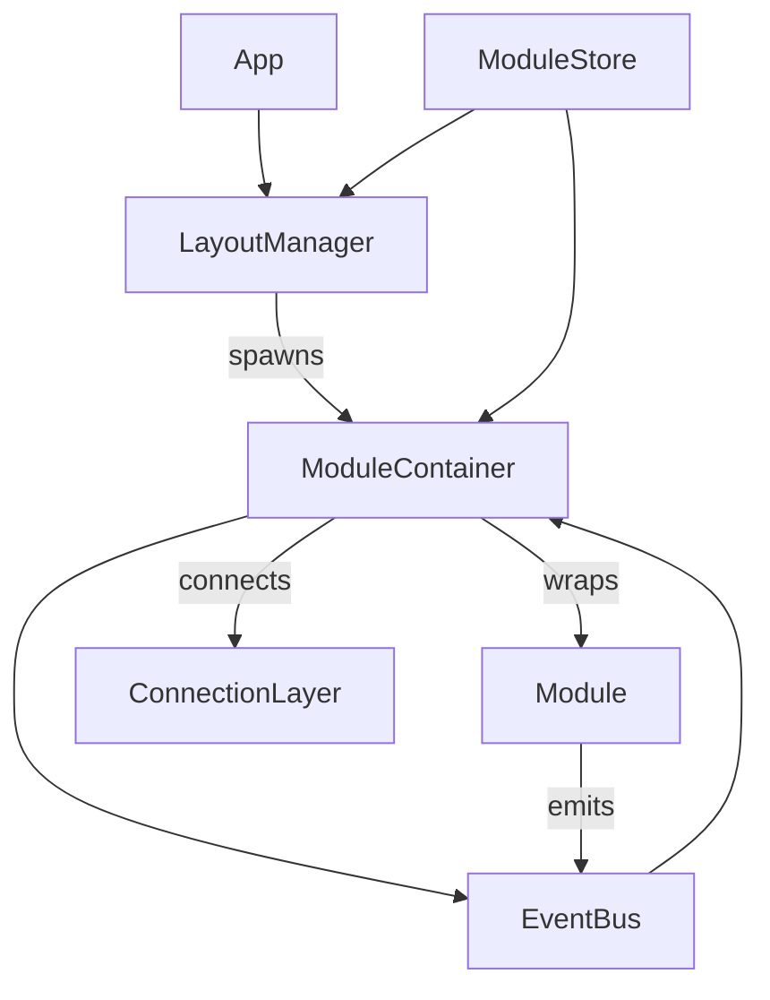

# DAWN Module System Architecture

## Overview
The DAWN module system is a highly modular, event-driven UI framework inspired by DAWN's glassmorphism and neural/quantum metaphors. It enables dynamic composition, interaction, and visualization of system modules.

---

## Architecture Diagram



---

## Core Concepts

- **Module**: A functional UI unit (e.g., NeuralProcessor, QuantumCore) with its own state, events, and visuals.
- **ModuleContainer**: Glassmorphic wrapper providing drag, resize, animation, header, and connection points.
- **LayoutManager/ModuleLayout**: Manages module positions, persistence, and connections.
- **Event Bus**: Shared event emitter for inter-module communication.
- **ConnectionLayer**: Visualizes connections (SVG/Framer Motion).
- **Module Store**: Zustand store for module configs, positions, and connections.

---

## Module Interaction

- Modules emit and listen for events via a shared EventEmitter or event bus.
- Connections between modules are visualized and can trigger data flow or UI changes.
- State is managed centrally (Zustand) and persisted in localStorage.

**Example: Emitting an event from a module**
```tsx
import { EventEmitter } from 'events';
const emitter = new EventEmitter();
emitter.emit('neural:spike', { source: 'NeuralProcessor', time: Date.now() });
```

**Example: Listening for an event**
```tsx
useEffect(() => {
  const handler = (data) => { /* ... */ };
  emitter.on('quantum:collapse', handler);
  return () => emitter.off('quantum:collapse', handler);
}, []);
```

---

## Extensibility

- New modules can be registered and spawned dynamically.
- ModuleContainer supports slot-based design for header, content, footer, and side panels.
- The system is agnostic to module internals—any React component can be a module.

---

## Visual Example


---

## See Also
- [Creating Modules](./CreatingModules.md)
- [Glass Design System](./GlassDesignSystem.md) 